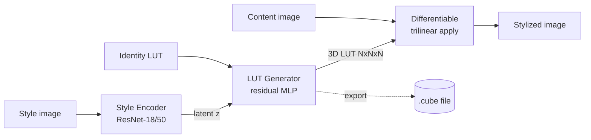
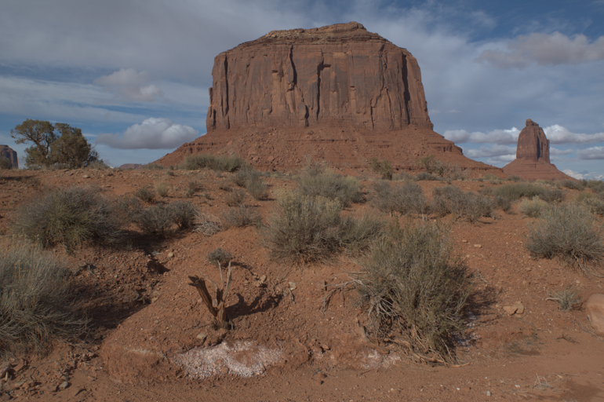

<div align="center">

# 🎨 LUT-GAN

**Learn a photographer's color grade from a single reference image — and turn it into a real, exportable 3D LUT.**

[](https://www.python.org/)
[](https://pytorch.org/)
[](https://www.gradio.app/)
[]()

</div>

---

## ✨ What it does

Give the model **one style image** (a color-graded photo, a film still, a frame you like the look of) and it predicts a **3D color LUT** that reproduces that grade. Apply the LUT to any content image — or **export it as a standard `.cube` file** and drop it straight into Photoshop, Premiere, DaVinci Resolve, OBS, or any tool that reads 3D LUTs.

Unlike pixel-to-pixel style transfer, the output is a **resolution-independent color transform**:

- 🎯 **Content-agnostic** — the same LUT works on any image, at any resolution.
- ⚡ **Cheap at inference** — applying a LUT is a lookup, not a forward pass per pixel.
- 🔁 **Portable** — `.cube` is an industry-standard format your existing tools already understand.
- 🧩 **Editable** — drop the exported LUT into your grading software and tweak it by hand.

## 🧠 How it works



1. **Style Encoder** — a ResNet backbone maps the reference image to a latent style vector `z`.
2. **LUT Generator** — an MLP predicts a *residual* on top of the identity LUT (so an untrained model is a no-op). The residual is `tanh`-bounded, optionally zero-meaned to avoid global brightness drift, and the pure-black / pure-white corners are hard-anchored so endpoints stay clean.
3. **Differentiable trilinear sampler** — applies the per-image LUT to the content image. Being differentiable, the *whole pipeline trains end-to-end* directly from images.

### Training signals

The generator is supervised by a blend of losses, each individually weighted:

| Loss | Purpose |
|------|---------|
| **Reconstruction (L1)** | Match the styled target image |
| **Adversarial (LSGAN)** | A *conditional* multi-scale PatchGAN judges `(content, output)` pairs for realism |
| **LUT supervision** | Optional direct match against a ground-truth `.cube` when available |
| **Total variation** | Keep the LUT smooth in 3D color space |
| **Identity** | Stay close to identity (with extra weight on shadows) to prevent artifacts |

The repo supports **single-style** training (one grade) and **multi-style** training (many grades conditioned on the reference), plus a two-stage recipe (`train_long.ps1`): LUT-supervised pretrain → GAN fine-tune.

## 🚀 Quick start

```bash
# Install (Python 3.9+)
pip install torch torchvision pillow tqdm gradio

# Launch the interactive demo
python app.py --ckpt checkpoints/best.pth --port 7860
```

Then open the printed URL, upload a **style image** (required) and optionally a **content image**, and download the generated `.cube` LUT.

## 🛠️ CLI tools

```bash
# Stylize one image with the LUT predicted from a style reference
python infer.py --ckpt <ckpt.pth> --style style.jpg --content photo.jpg --output out.jpg

# Export a reusable 3D LUT from a style image
python export_lut.py --ckpt <ckpt.pth> --style style.jpg --lut_path outputs/my_look.cube

# Evaluate a predicted LUT against a ground-truth .cube (reports LUT L1 + output PSNR)
python eval_lut.py --ckpt <ckpt.pth> --style style.jpg --lut gt.cube --content photo.jpg
```

> All scripts auto-detect CUDA; pass `--device cpu` to force CPU.

## 🏋️ Training

```bash
# Single-style: content/target paired by identical filename
python train.py --content_dir data/content --target_dir data/styled --save_dir checkpoints

# Multi-style: style_root/<name>/ and target_root/<name>/ subfolders, optional LUT supervision
python train.py --content_dir data/content \
                --style_root data/styles --target_root data/targets \
                --lut_root style_luts --save_dir checkpoints
```

Key knobs: `--lut_size` (LUT grid resolution), `--encoder_arch resnet18|resnet50`,
`--delta_scale` (LUT strength), and the `--lambda_*` loss weights. Checkpoints embed their
own hyperparameters, so inference/export tools reconstruct the exact model automatically.

## 📊 Results

> _Sample comparisons coming soon._

<!--
| Content | Style reference | Stylized output |
|:---:|:---:|:---:|
|  |  |  |
-->

## 📁 Project layout

```
app.py            Gradio demo
infer.py          CLI: style + content -> stylized image
export_lut.py     CLI: style -> .cube 3D LUT
eval_lut.py       CLI: predicted LUT vs ground truth (L1 / PSNR)
train.py          Training loop (single- & multi-style)
dataset.py        Paired / multi-style dataset loaders
lut_io.py         .cube read + trilinear resample
preprocess.py     Image transforms
modules/
  style_encoder.py    ResNet style encoder
  lut_generator.py    Residual-on-identity LUT generator
  lut3d.py            Identity LUT + differentiable trilinear apply
  discriminator.py    Conditional multi-scale PatchGAN
  losses.py           TV + identity (shadow-weighted) losses
style_luts/       Reference .cube LUTs (training supervision)
```

## 🧰 Tech stack

PyTorch · torchvision · Gradio · NumPy/PIL — trained on Adobe FiveK-style image pairs.
